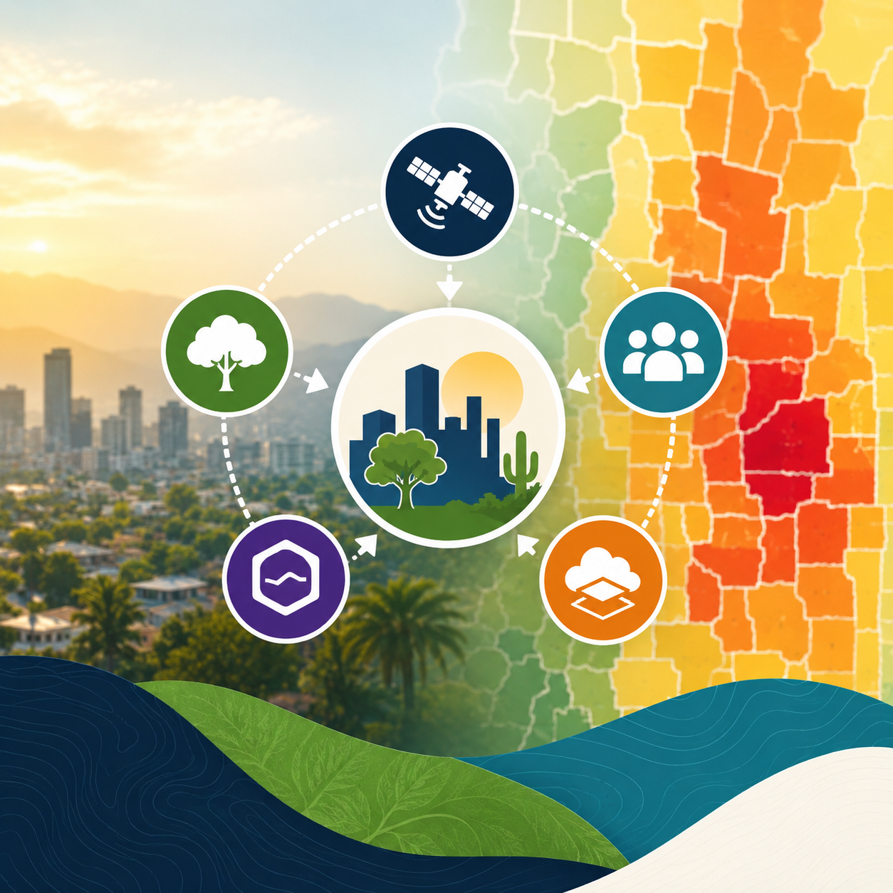
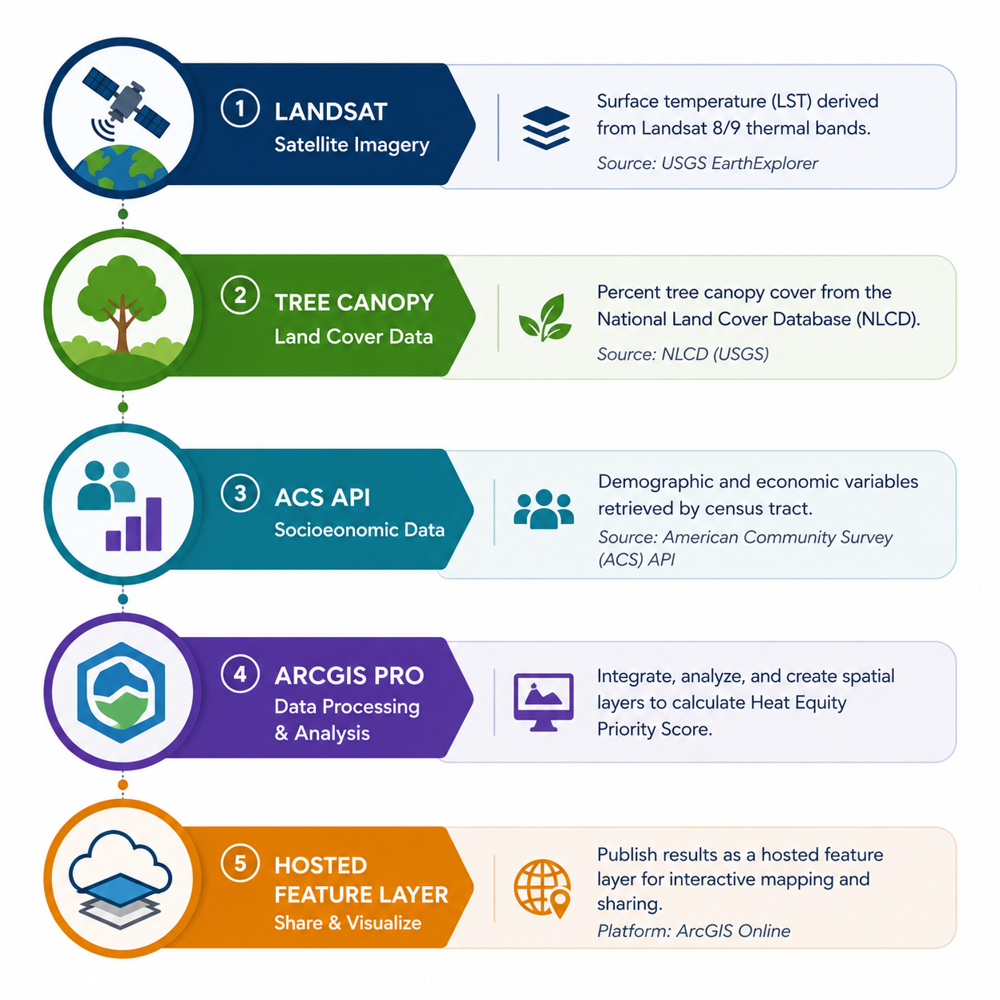
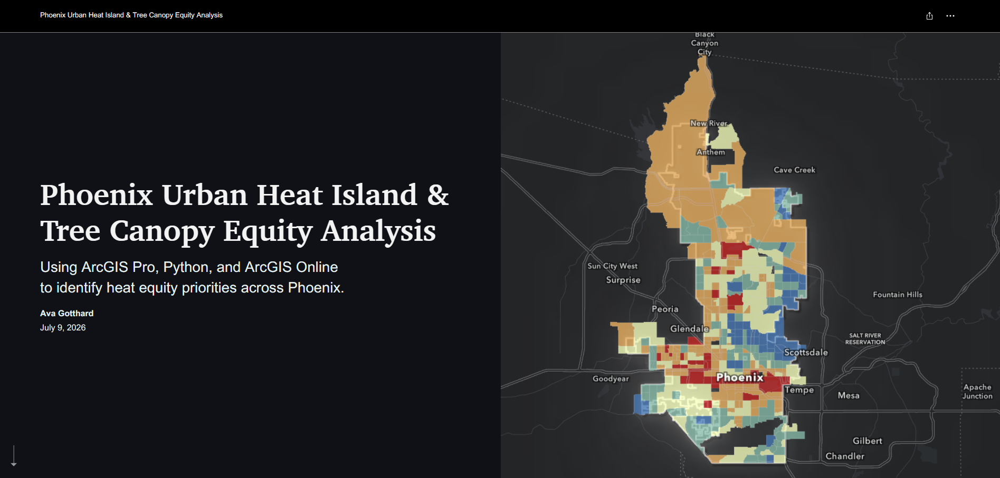
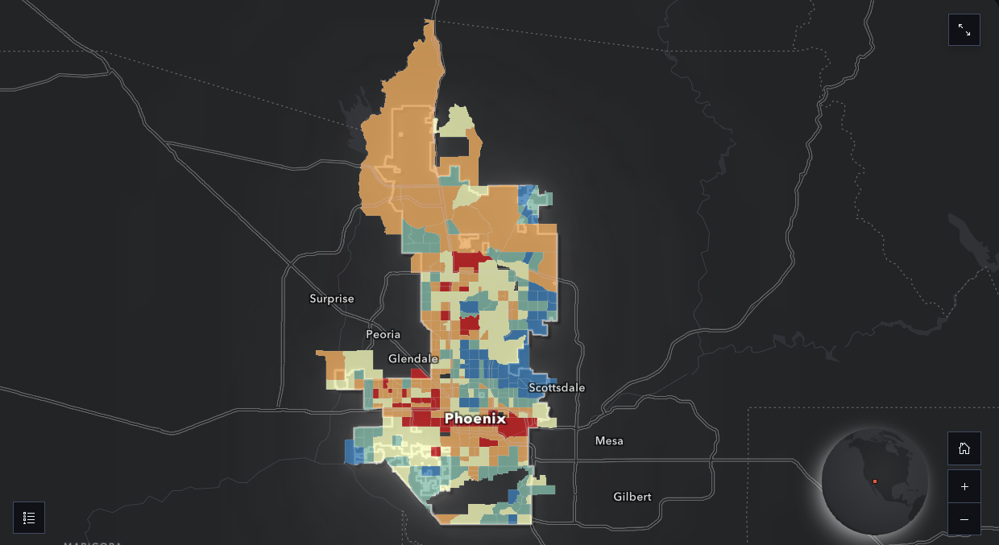
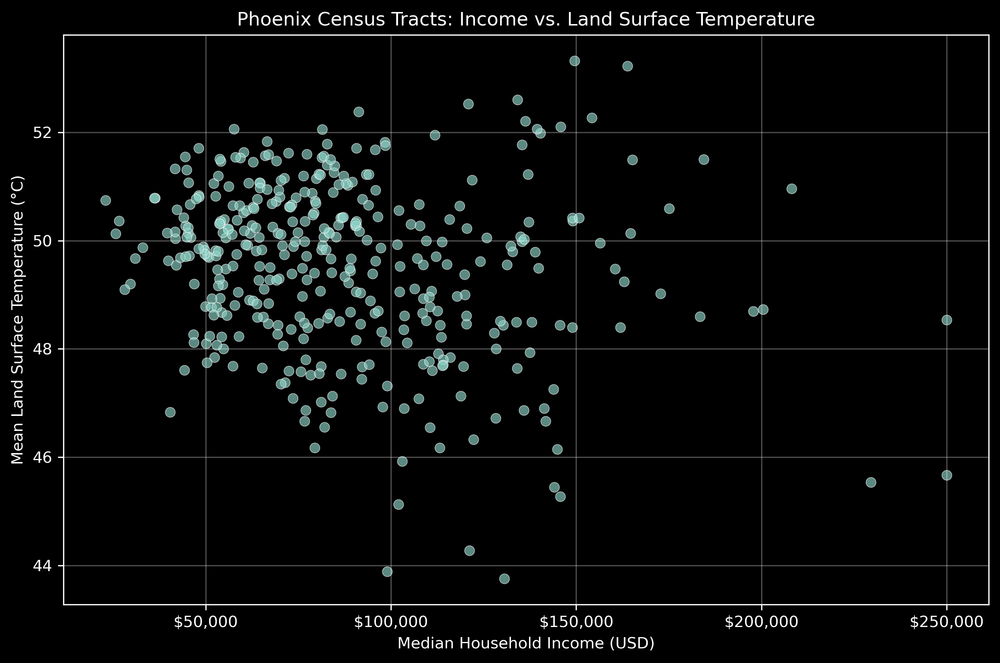
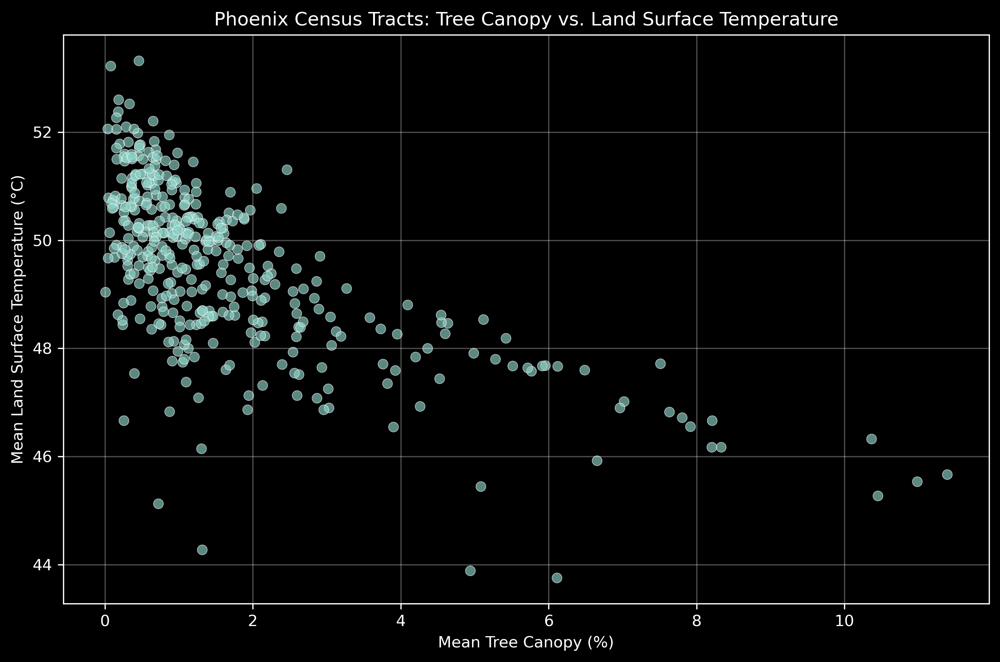
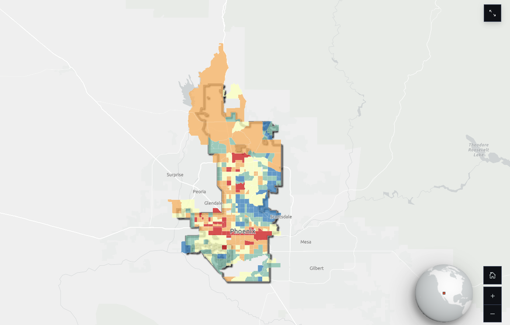
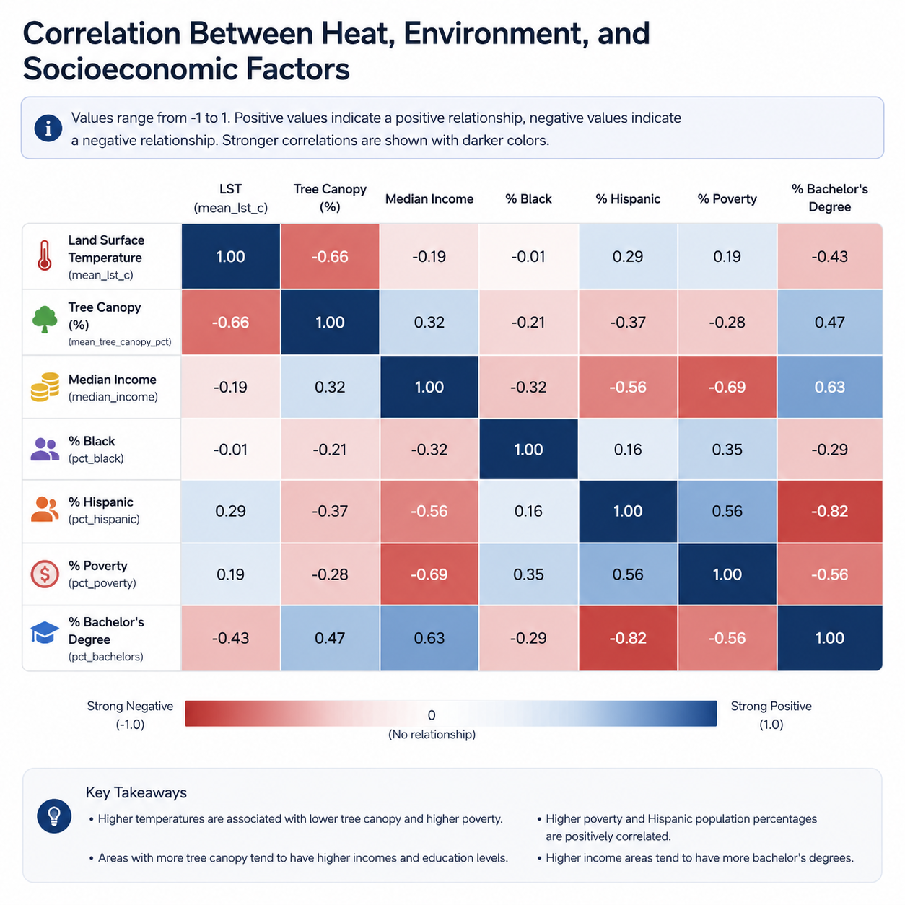

# Phoenix Urban Heat Island & Tree Canopy Equity Analysis
*A reproducible GIS and Python workflow for identifying urban heat equity priorities using Landsat, tree canopy, and U.S. Census data.*
<p align="center">
  
</p>

### Interactive Products
- 🌐 StoryMap: <https://storymaps.arcgis.com/stories/e975b895c9354858ac33ba7044ac577a>
- 🗺️ Interactive Web Map: <https://arcg.is/0P14nu1>
- 📊 Hosted Feature Layer: <https://arcgotthard.maps.arcgis.com/home/item.html?id=ce7bf1e5ed3d44abb6b15c9e865dcad8#overview>

## Project Overview

This project demonstrates a fully automated GIS workflow for identifying urban heat equity priorities across the City of Phoenix, Arizona. Using Landsat Collection 2 thermal imagery, National Land Cover Database (NLCD) Tree Canopy Cover, and American Community Survey (ACS) demographic data, the workflow quantifies the relationship between land surface temperature, tree canopy, and socioeconomic characteristics at the census tract level.

The project was developed as a professional portfolio piece to demonstrate geospatial analysis, Python automation, remote sensing, and ArcGIS Online publishing using reproducible workflows.

---

## Objectives

- Quantify land surface temperature using Landsat Collection 2 imagery
- Measure tree canopy cover using NLCD Tree Canopy data
- Integrate ACS demographic indicators through the Census API
- Calculate a Heat Equity Priority Score
- Publish an interactive web map and hosted feature layer to ArcGIS Online
- Demonstrate a reproducible GIS workflow using Python and ArcPy

---

## Workflow
<p align="center">
  
</p>

The workflow consists of five major stages:

1. Data Acquisition
2. Data Preparation
3. Indicator Calculation
4. Visualization & Analysis
5. ArcGIS Online Publishing

---

## Outputs

### StoryMap

<p align="center">
  
</p>

### Interactive Web Map

<p align="center">
  
</p>

<h3>Example Analysis</h3>

<p align="center">
  
  
</p>

<p align="center">
<b>Income vs Temperature</b> &nbsp;&nbsp;&nbsp;&nbsp;&nbsp;&nbsp;&nbsp;&nbsp;&nbsp;&nbsp;&nbsp;&nbsp;&nbsp;&nbsp;&nbsp;&nbsp;&nbsp;&nbsp;&nbsp;&nbsp;
<b>Tree Canopy vs Temperature</b>
</p>
---

## Data Sources

| Dataset | Source |
|---|---|
| Landsat Collection 2 Level-2 | Microsoft Planetary Computer |
| Tree Canopy Cover | National Land Cover Database (NLCD) |
| Census Tracts | U.S. Census Bureau TIGER/Line |
| Demographics | U.S. Census Bureau ACS 5-Year Estimates |
---

## Repository Structure

```
UrbanHeatEquity/
│
├── data/
├── notebooks/
├── scripts/
├── outputs/
├── docs/
├── README.md
├── environment.yml
└── .gitignore
```

---

## Requirements

Create the project environment using Conda:

```bash
conda env create -f environment.yml
```

---

## Running the Workflow

Run the notebooks in the following order:

1. 01_acquire_data.ipynb
2. 02_prepare_data.ipynb
3. 03_calculate_indicators.ipynb
4. 04_analyze_visualize.ipynb
5. 05_publish_arcgis_online.ipynb

---

## Results
<p align="center">
  
</p>

## Correlation Analysis

<p align="center">
  
</p>

The completed workflow produces:

- Hosted Feature Layer
- Interactive Web Map
- StoryMap
- Statistical Tables
- Publication-quality Figures
- Reproducible Python Workflow

---

## Technologies

- ArcGIS Pro
- ArcGIS Online
- ArcPy
- ArcGIS API for Python
- Python
- pandas
- matplotlib
- Remote Sensing
- Landsat Collection 2
- Census API
---

## Contact

Ava Gotthard

LinkedIn:
<https://linkedin.com/in/agotthard>

Portfolio:
<https://arcgotthard.maps.arcgis.com/home/index.html>


## License and Data Use

The Python code, documentation, and original project materials are © Ava Gotthard and licensed under the MIT License. Public datasets remain subject to the terms and licenses of their respective providers.
